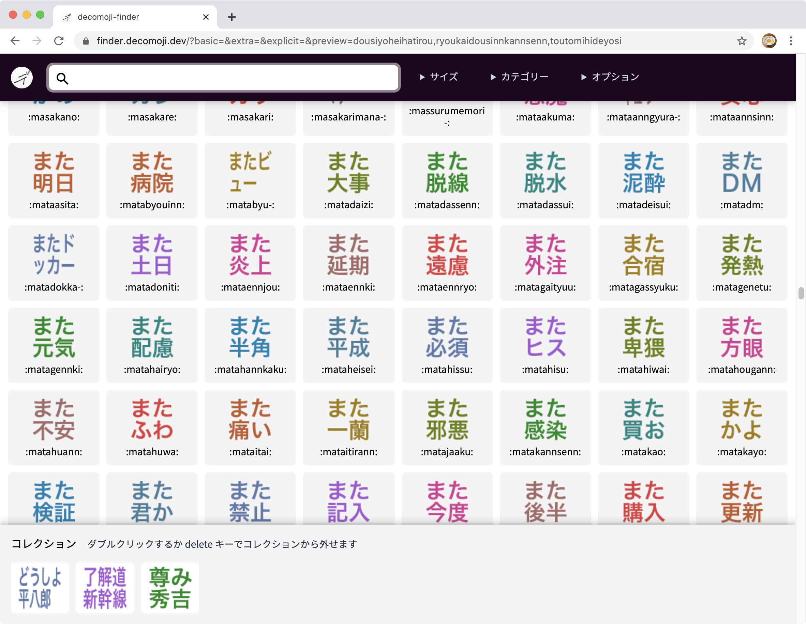

# デコモジファインダー v2

https://finder.decomoji.dev

オリジナルSlack用カスタムリアクション絵文字「[デコモジ（decomoji）](https://git.io/decomoji)」がたくさんありすぎて、何が何だかわからなくなっていませんか？

デコモジファインダーは、デコモジに含まれているものを閲覧・条件検索できるツールです。

## 特徴

- インクリメンタルサーチ
- 正規表現検索
- 基本セット、拡張セット、v5プレビューの表示と検索対象切り替え
- ダークモード表示のエミュレート
- コレクション

カテゴリーの切り替え、Slackダークモードをエミュレートした表示をしながら、正規表現でインクリメンタルサーチができます。

さらに、表示したデコモジをクリックすると「コレクション」が作られ、固有URLでシェア可能です。

眺めて楽しい！　探して楽しい！　集めてシェアしてみんなで楽しい！

デコモジファインダーはあなたのデコモジライフをさらに彩ります！

## ライセンス

Copyright (c) 2019 decomoji consortium and other contributors.

Under the MIT License.

## スペシャルサンクス！

[@geckotang](https://github.com/geckotang), [@ginpei](https://github.com/ginpei), [@turusuke](https://github.com/turusuke), [@tsmd](https://github.com/tsmd), [@yuhei](https://github.com/yuhei), [@masup9](https://github.com/masup9) and decomoji consortium!