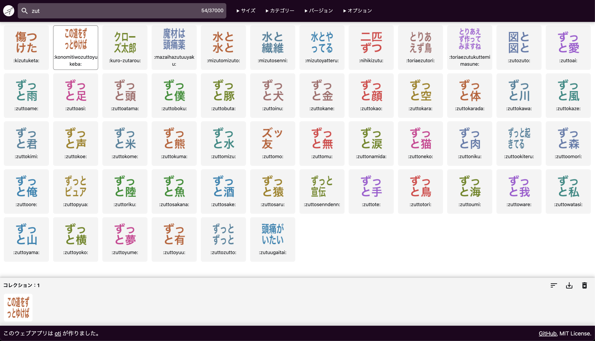

# デコモジファインダー v3

https://finder.decomoji.dev

Slack で使えるカスタム絵文字「[デコモジ（decomoji）](https://git.io/decomoji)」がたくさんありすぎて、何が何だかわからなくなっていませんか？

デコモジファインダーは、デコモジに含まれているものを閲覧・条件検索できるツールです。

## 特徴

- インクリメンタルサーチできる！
- 正規表現で絞り込める！
- 基本セット、拡張セット、露骨セットの表示と検索対象を切り替えられる！
- ダークモード表示のエミュレートができる！
- コレクションを作って固有のパーマリンクで共有できる！

眺めて楽しい！　探して楽しい！　集めてシェアしてみんなで楽しい！

デコモジファインダーはあなたのデコモジライフをさらに彩ります！

## ライセンス

Copyright (c) oti. Under the [MIT License](LICENSE).

## スペシャルサンクス！

[@geckotang](https://github.com/geckotang), [@ginpei](https://github.com/ginpei), [@turusuke](https://github.com/turusuke), [@tsmd](https://github.com/tsmd), [@yuhei](https://github.com/yuhei), [@masup9](https://github.com/masup9), [@1000ch](https://github.com/1000ch) and decomoji consortium!
